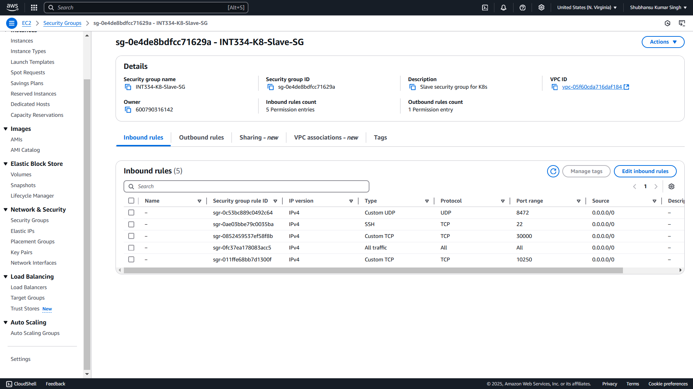
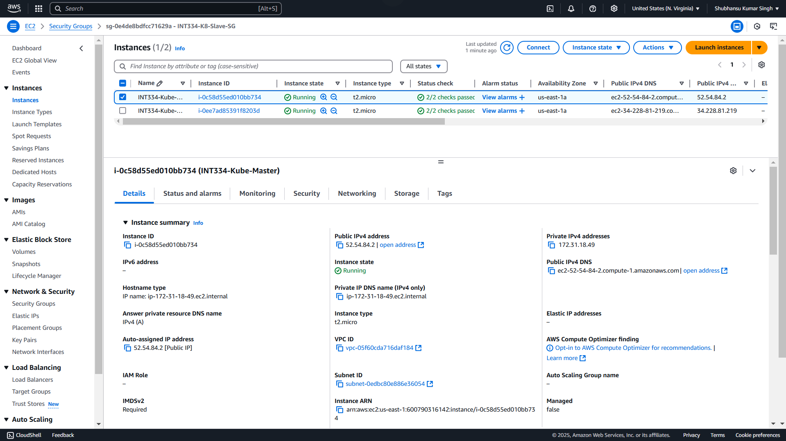

# Kubernetes Installation & Dashboard Setup using Kubeadm

## 1. Create Security Groups on AWS

### 1.1 Master Node Security Group (`K8-Master-SG`)

1. Go to **Security Groups** in the AWS Console.
2. Click **Create Security Group** and name it `K8-Master-SG`.

#### Inbound Rules

| Type         | Protocol | Port Range     | Source          |
|--------------|----------|----------------|-----------------|
| Custom TCP   | TCP      | 6443           | Anywhere-IPv4   |
| Custom TCP   | TCP      | 2379 - 2380    | Anywhere-IPv4   |
| Custom TCP   | TCP      | 10250          | Anywhere-IPv4   |
| Custom TCP   | TCP      | 10259          | Anywhere-IPv4   |
| Custom TCP   | TCP      | 10257          | Anywhere-IPv4   |
| SSH          | TCP      | 22             | Anywhere-IPv4   |
| Custom UDP   | UDP      | 8472           | Anywhere-IPv4   |
| All traffic  | All      | All            | Anywhere-IPv4   |

#### Outbound Rules

| Type        | Protocol | Port Range | Source        |
|-------------|----------|------------|---------------|
| All traffic | All      | All        | Anywhere-IPv4 |

> After adding the rules, click **Create Security Group**.

---

### 1.2 Worker Node Security Group (`K8-Slave-SG`)

1. Repeat the steps to create a new security group named `K8-Slave-SG`.

#### Inbound Rules

| Type         | Protocol | Port Range     | Source          |
|--------------|----------|----------------|-----------------|
| Custom TCP   | TCP      | 10250          | Anywhere-IPv4   |
| Custom TCP   | TCP      | 30000 - 32767  | Anywhere-IPv4   |
| SSH          | TCP      | 22             | Anywhere-IPv4   |
| Custom UDP   | UDP      | 8472           | Anywhere-IPv4   |
| All traffic  | All      | All            | Anywhere-IPv4   |

#### Outbound Rules

| Type        | Protocol | Port Range | Source        |
|-------------|----------|------------|---------------|
| All traffic | All      | All        | Anywhere-IPv4 |

> Click **Create Security Group** to save.

Images for reference:




---

## 2. Launch EC2 Instances

### 2.1 Launch the Master Instance

1. Go to **EC2 Dashboard** and click **Launch Instance**.
2. Use the following configuration:
   - **Name:** `kube-master`
   - **AMI:** Ubuntu Server 20.04 LTS (HVM)
   - **Instance Type:** `t2.medium`
   - **Key Pair:** Create or choose an existing one.
   - **Network Settings:** Use existing security group `K8-Master-SG`
3. Click **Launch Instance**.

### 2.2 Launch the Worker (Slave) Instance

1. Repeat the above steps but with:
   - **Name:** `kube-slave`
   - **Security Group:** `K8-Slave-SG`

Images:



---

## 3. Setup Master Node

### 3.1 Connect via SSH

1. Select the master EC2 instance and click **Connect** to SSH into it.

Image:


### 3.2 Basic Setup

Run the following commands:

```bash
sudo hostnamectl set-hostname master
sudo su
sudo apt-get update && sudo apt-get upgrade -y
sudo reboot -f
```

> Reconnect after reboot.

### 3.3 Install Docker & Kubernetes Tools

```bash
sudo apt-get update
sudo apt-get install -y docker.io
sudo mkdir -p /etc/apt/keyrings
curl -fsSL https://pkgs.k8s.io/core:/stable:/v1.30/deb/Release.key | sudo gpg --dearmor -o /etc/apt/keyrings/kubernetes-apt-keyring.gpg
echo 'deb [signed-by=/etc/apt/keyrings/kubernetes-apt-keyring.gpg] https://pkgs.k8s.io/core:/stable:/v1.30/deb/ /' | sudo tee /etc/apt/sources.list.d/kubernetes.list
sudo apt-get update
sudo apt-get install -y kubelet kubeadm kubectl
sudo apt-mark hold kubelet kubeadm kubectl
sudo systemctl enable --now kubelet
sudo swapoff -a
sudo sed -i '/swap/d' /etc/fstab
sudo mount -a
free -h
sudo kubeadm config images pull
```

### 3.4 Check Docker and Kubelet Status

```bash
sudo systemctl status docker
sudo systemctl status kubelet
```

### 3.5 Initialize Kubernetes Cluster

Replace `<privateIpAddress>` with your master node’s private IP:

```bash
sudo kubeadm init --apiserver-advertise-address=<privateIpAddress> --pod-network-cidr=192.168.0.0/16 --ignore-preflight-errors=all
```

Example:

```bash
sudo kubeadm init --apiserver-advertise-address=172.31.93.4 --pod-network-cidr=192.168.0.0/16 --ignore-preflight-errors=all
```

> Copy the join token generated in the output.

Example token:

```bash
kubeadm join 172.31.93.4:6443 --token 1j38uf.tqkvgc0fqtnab21d \
    --discovery-token-ca-cert-hash sha256:e85655b6443c01fa0f5809d27d103a25ae2aba125a6e841aa0007df6c9870ab7
```

### 3.6 Configure kubectl for the User

```bash
mkdir -p $HOME/.kube
sudo cp -i /etc/kubernetes/admin.conf $HOME/.kube/config
sudo chown $(id -u):$(id -g) $HOME/.kube/config
export KUBECONFIG=/etc/kubernetes/admin.conf
```

### 3.7 Install Calico Network Plugin

```bash
kubectl create -f https://raw.githubusercontent.com/projectcalico/calico/v3.25.0/manifests/tigera-operator.yaml
kubectl create -f https://raw.githubusercontent.com/projectcalico/calico/v3.25.0/manifests/custom-resources.yaml
kubectl apply -f https://docs.projectcalico.org/manifests/calico.yaml
curl -I https://raw.githubusercontent.com/projectcalico/calico/v3.25.0/manifests/tigera-operator.yaml
```

Image:


---

## 4. Setup Worker (Slave) Node

### 4.1 Basic Setup

```bash
sudo apt-get update
sudo hostnamectl set-hostname slave
sudo su
sudo apt-get update && sudo apt-get upgrade -y
```

### 4.2 Install Docker and Kubernetes

```bash
sudo apt-get install -y docker.io
sudo mkdir -p /etc/apt/keyrings
curl -fsSL https://pkgs.k8s.io/core:/stable:/v1.30/deb/Release.key | sudo gpg --dearmor -o /etc/apt/keyrings/kubernetes-apt-keyring.gpg
echo 'deb [signed-by=/etc/apt/keyrings/kubernetes-apt-keyring.gpg] https://pkgs.k8s.io/core:/stable:/v1.30/deb/ /' | sudo tee /etc/apt/sources.list.d/kubernetes.list
sudo apt-get update
sudo apt-get install -y kubelet kubeadm kubectl
sudo apt-mark hold kubelet kubeadm kubectl
sudo systemctl enable --now kubelet
sudo swapoff -a
sudo sed -i '/swap/d' /etc/fstab
sudo mount -a
free -h
```

### 4.3 Join the Cluster

Use the token and command from the master node:

```bash
sudo kubeadm join <master-ip>:6443 --token <token> --discovery-token-ca-cert-hash sha256:<hash>
```

> Replace the placeholders with the actual values.

---

## 5. Verify Cluster Status

From the **master node**:

```bash
kubectl get nodes
```

Image:


### If Connection is Refused

```bash
sudo systemctl restart kubelet
ps aux | grep kube-apiserver
```
