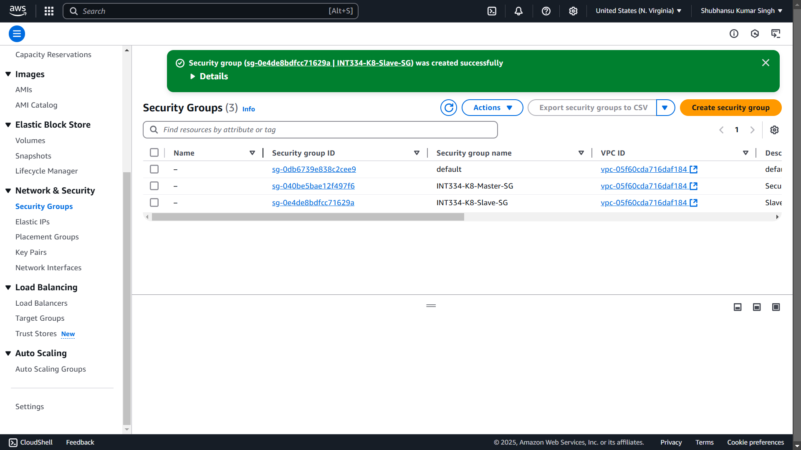
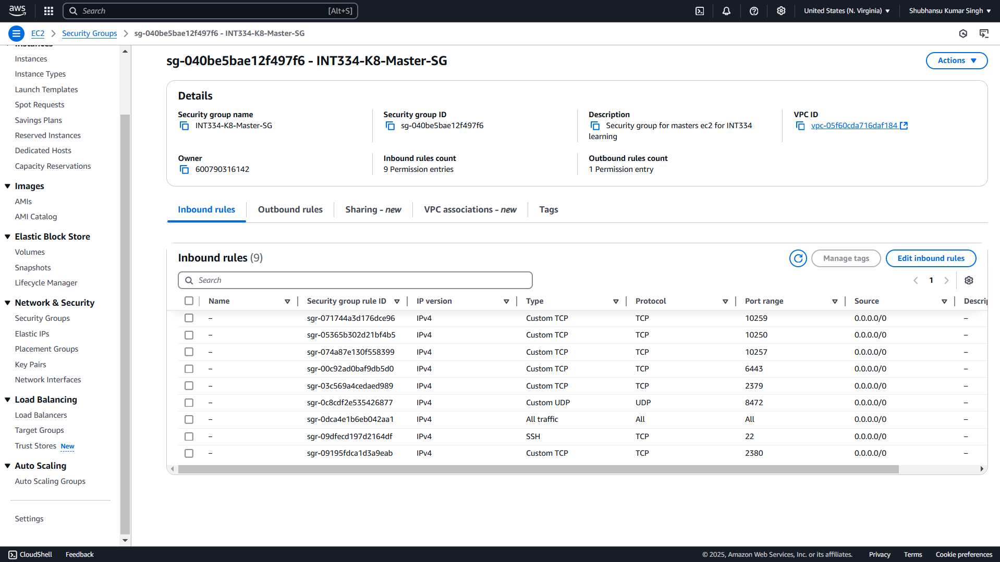
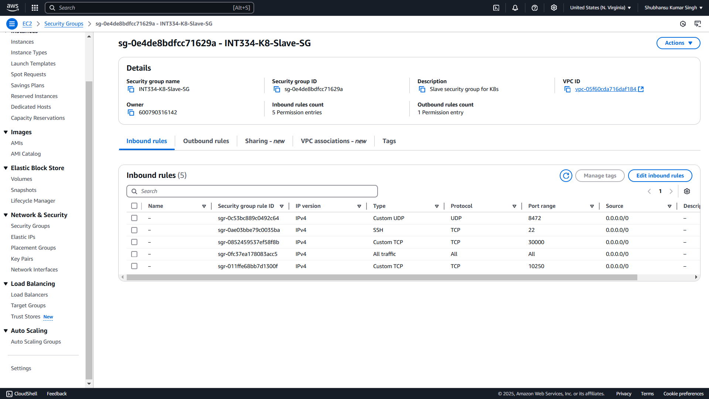
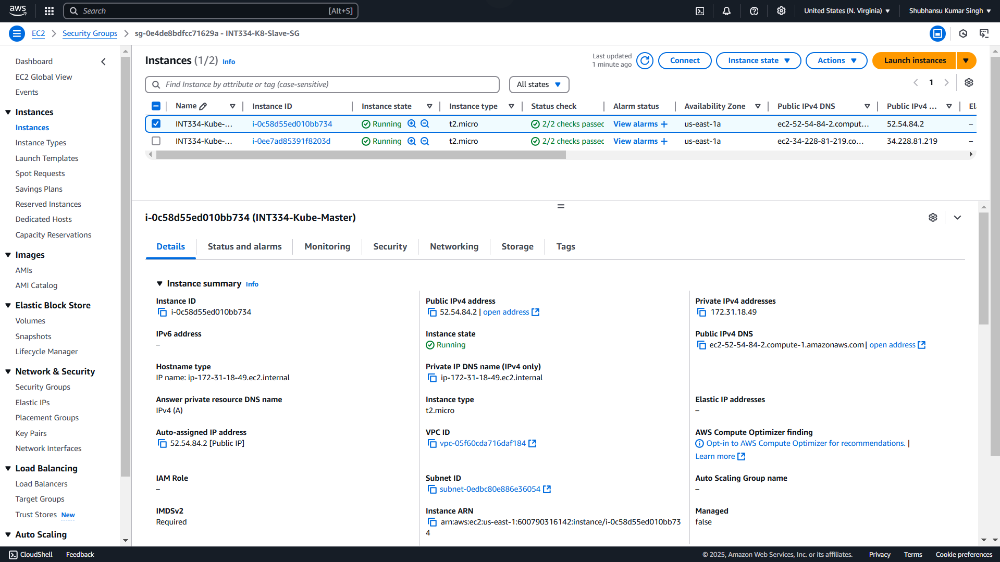
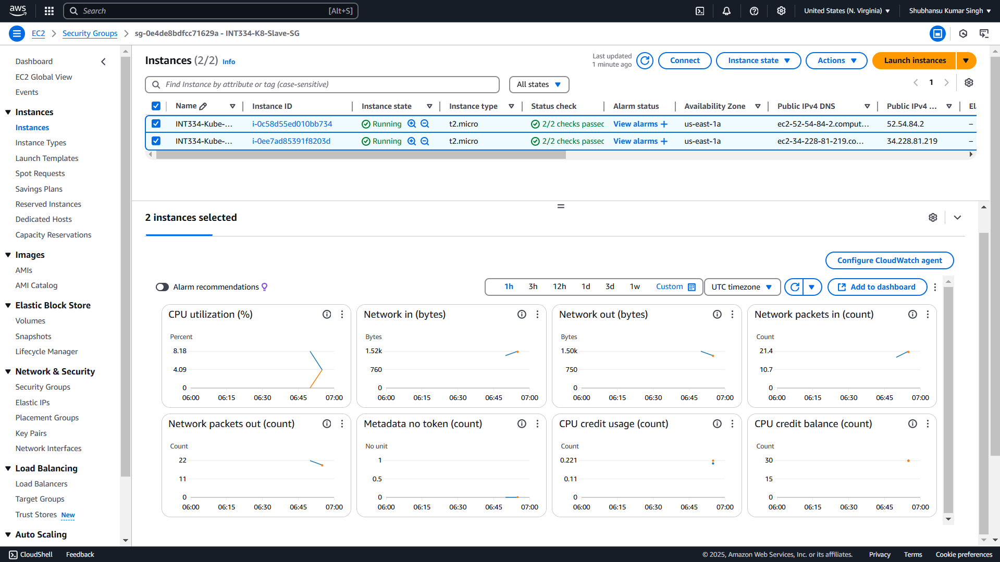
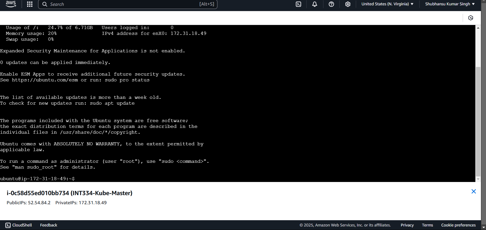
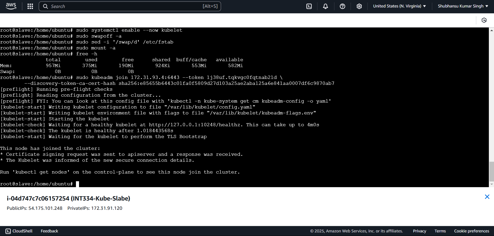

# Install Kubernetes & Setup Dashboard using Kubeadm

## Create Security Group

Step-1:	In Aws Dashboard go to `Security Groups` under Network & Security Group. & Click on ‘Create security group`.

Enter a name for the security group. Which will use later in master instance. We will use `K8-Master-SG` as Security group name.

Step-2:	Click Add rule and under ‘Inbound rules` and add the roles.

Type	    Protocol	Port range	Source

Custom TCP	TCP	        6443	    Anywhere-IPv4
Custom TCP	TCP	        2379 - 2380	Anywhere-IPv4
Custom TCP	TCP	        10250	    Anywhere-IPv4
Custom TCP	TCP	        10259	    Anywhere-IPv4
Custom TCP	TCP	        10257	    Anywhere-IPv4
SSH	        TCP	        22	        Anywhere-IPv4
Custom UDP	UDP	        8472	    Anywhere-IPv4
All traffic	All	        All	        Anywhere-IPv4

Step-3:	Click Add rule and under ‘Outbound rules` and add the roles.

Type	Protocol	Port range	Source
All traffic	All	All	Anywhere-IPv4

Step-4:	Click ` Create security group` below the page & save.

Step-5:	Now we have to create another security group or slave. Click on `Create security group`.

Enter a name for the security group. Which will use later in master instance. We will use `K8-Slave-SG` as Security group name.

Step-6:	Click Add rule and under ‘Inbound rules` and add the roles.

Type	     Protocol	Port range	    Source
 
Custom TCP	 TCP	    10250	        Anywhere-IPv4
Custom TCP	 TCP	    30000 - 32767	Anywhere-IPv4
SSH	         TCP	    22	            Anywhere-IPv4
Custom UDP	 UDP	    8472	        Anywhere-IPv4
All traffic	 All	    All	            Anywhere-IPv4

Step-7:	Click Add rule and under ‘Outbound rules` and add the roles.

Type	        Protocol	Port range	Source
All traffic	    All	        All	        Anywhere-IPv4

Step-8:	Click ` Create security group` below the page & save.

## Create EC2 Instance

Step-9:	Go to the AWS Console, EC2 Service and click on `Launch instance`.
Step-10:	Name of the instance as `kube-master` and choose `Ubuntu Server 20.04 LTS (HVM), SSD Volume Type` as Amazon Machine Image (AMI).
Step-11:	Choose ` t2.medium` as Instance type.
Step-12:	Create key pair.
Step-13:	On Network settings choose Select existing security group and select `K8-Master-SG`. Finally click on `launch instance`.

Step-14:	Repeat the steps (Step-9 to Step-13) above to create the slave instance. Keep the same configuration and just name it `kube-slave` and choose the `K8-Slave-SG` security group.

## Working with Master Instance

1. Select the master EC2 instance and click on connect. This will secure us a connection to the ec2 instance via ssh
2. 
3. Run the following commands one by one in remote desk to setup the instance (Master) :
   1. `sudo hostnamectl set-hostname master`
   2. `sudo su`
   3. `sudo apt-get update && sudo apt-get upgrade -y`
   4. `sudo reboot -f`
4. It will take few minutes. Then reconnect the instance.
5. Install kubelet, kubeadm and kubectl. Run the following commands
   1. `sudo apt-get update`
   2. `sudo apt-get install -y docker.io`
   3. `sudo mkdir -p /etc/apt/keyrings`
   4. `curl -fsSL https://pkgs.k8s.io/core:/stable:/v1.30/deb/Release.key | sudo gpg --dearmor -o /etc/apt/keyrings/kubernetes-apt-keyring.gpg`
   5. `echo 'deb [signed-by=/etc/apt/keyrings/kubernetes-apt-keyring.gpg] https://pkgs.k8s.io/core:/stable:/v1.30/deb/ /' | sudo tee /etc/apt/sources.list.d/kubernetes.list`
   6. `sudo apt-get update`
   7. `sudo apt-get install -y kubelet kubeadm kubectl`
   8. `sudo apt-mark hold kubelet kubeadm kubectl`
   9. `sudo systemctl enable --now kubelet`
   10. `sudo swapoff -a`
   11. `sudo sed -i '/swap/d' /etc/fstab`
   12. `sudo mount -a`
   13. `free -h`
   14. `sudo kubeadm config images pull`
6. Check for Docker status and kubernetes status
   1. `sudo systemctl status docker`
   2. `sudo systemctl status kubelet`
7. Initialise Kubernetes cluster (replace private ip address)
   1. `sudo kubeadm init --apiserver-advertise-address=<privateIpAddress> --pod-network-cidr=192.168.0.0/16 --ignore-preflight-errors=all`
   2. After replacing the ip address with private ip address of the master ec2 : You can get this in aws 
   3. `sudo kubeadm init --apiserver-advertise-address=172.31.93.4 --pod-network-cidr=192.168.0.0/16 --ignore-preflight-errors=all`
   4. This command outputs a token for joining the cluster. Copy this token to  be used later in slave.
   5. `kubeadm join 172.31.93.4:6443 --token 1j38uf.tqkvgc0fqtnab21d \
        --discovery-token-ca-cert-hash sha256:e85655b6443c01fa0f5809d27d103a25ae2aba125a6e841aa0007df6c9870ab7`
8. Setup KubeCTL for default user
   1. `mkdir -p $HOME/.kube`
   2. `sudo cp -i /etc/kubernetes/admin.conf $HOME/.kube/config`
   3. `sudo chown $(id -u):$(id -g) $HOME/.kube/config`
9. Export Kubeconfig env variable
   1.  `export KUBECONFIG=/etc/kubernetes/admin.conf`
10. Install the Calico Network Plugin
    1. `kubectl create -f https://raw.githubusercontent.com/projectcalico/calico/v3.25.0/manifests/tigera-operator.yaml`
    2. `kubectl create -f https://raw.githubusercontent.com/projectcalico/calico/v3.25.0/manifests/custom-resources.yaml`
    3. `kubectl apply -f https://docs.projectcalico.org/manifests/calico.yaml`
    4. `curl -I https://raw.githubusercontent.com/projectcalico/calico/v3.25.0/manifests/tigera-operator.yaml`
11. 

## Working with slave instance

1. Update the Package List:
   1. `sudo apt-get update`
   2. `sudo hostnamectl set-hostname slave`
   3. `sudo su`
   4. `sudo apt-get update && sudo apt-get upgrade -y`
2. Install Docker:
   1. `sudo apt-get install -y docker.io`
3. Add Kubernetes GPG Key:
   1. `sudo mkdir -p /etc/apt/keyrings`
   2. `curl -fsSL https://pkgs.k8s.io/core:/stable:/v1.30/deb/Release.key | sudo gpg --dearmor -o /etc/apt/keyrings/kubernetes-apt-keyring.gpg`
4. Add Kubernetes APT Repository:
   1. `echo 'deb [signed-by=/etc/apt/keyrings/kubernetes-apt-keyring.gpg] https://pkgs.k8s.io/core:/stable:/v1.30/deb/ /' | sudo tee /etc/apt/sources.list.d/kubernetes.list`
5. Update the Package List Again:
   1. `sudo apt-get update`
6. Install Kubernetes Components:
   1. `sudo apt-get install -y kubelet kubeadm kubectl`
7. Prevent Automatic Updates to Kubernetes Components:
   1. `sudo apt-mark hold kubelet kubeadm kubectl`
8. Enable and Start the kubelet Service:
   1. `sudo systemctl enable --now kubelet`
9. Disable Swap:
    1. `sudo swapoff -a`
10. Remove Swap Entry from /etc/fstab:
    1. `sudo sed -i '/swap/d' /etc/fstab`
11. Reload /etc/fstab:
    1. `sudo mount -a`
12. Verify Memory Status:
    1. `free -h`
13. Join the Worker Node to the Kubernetes Cluster: 
    1. Use the join command generated by the master node when you ran kubeadm init. It should look something like this:
    2. `sudo kubeadm join <master-ip>:6443 --token <token> --discovery-token-ca-cert-hash sha256:<hash>`
    3. `Replace <master-ip>, <token>, and <hash> with the appropriate values.`
14. Check Node Status (from the master node):
    1.  After joining the worker node, you can check the status from the master node:
    2.  `kubectl get nodes`
    3.  
    4.  In master's instance - restart the kubectl if connection is refused
        1.  `sudo systemctl restart kubelet`
